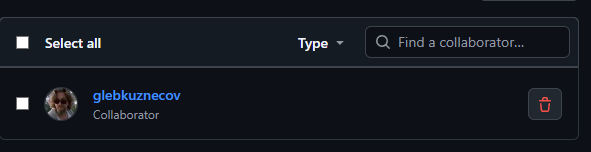
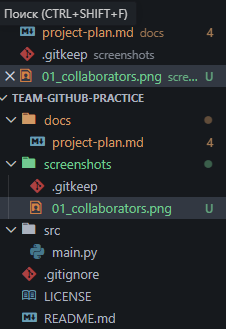
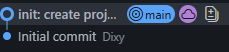
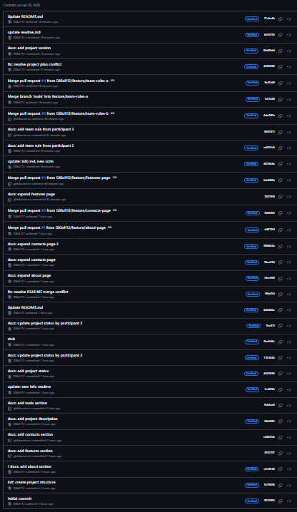

# Практическая работа: совместная разработка на GitHub

## Состав команды
| Участник | GitHub | Роль |
|---|---|---|
| V_Y | DXlol112 | Владелец репозитория |
| V_Y | DXlol112 | Разработчик |
| Gleb | glebkuznecov | Разработчик |
| Gleb | glebkuznecov | Проверяющий |
## Цель работы
Научится работать с Git, GitHub в команде

## Используемые инструменты
- Git;
- GitHub;
- VS Code.
## Ход работы

### 1. Создание репозитория и добавление участников

### 2. Клонирование проекта

Был сделан git clon

### 3. Первый push

Первый пуш структуры проекта

### 4. Работа с изменениями других участников
Каждый участник работал над даными заданиями согласно инструкции
Разделение было Dxlol 1,2 участник glebkuznecov 3.4

### 5. Ошибка при Push без Pull
Новые версии Vs в принципе не дают сделать push или commit без pull

### 6. Merge conflict
Глава репозитория DXlol забирал все конфликты слияния на себя, и выбор сводился на тукнуть пальцем в небо.

### 7. Работа с ветками
Ветки для создания дополнительной или редактирования документации.

### 8. Pull Request
Создавали pull request все участники и сливали если были без конфликтов.

### 9. Конфликт в Pull Request
Проблема разных слов, исправлено тем что оставили только самый верхний вариант
### 10. Fetch и Pull
Fetch только скачать, а pull сразу вставить
## История коммитов

## Вывод
- что получилось: Доделаи работу, пороктиковали git, Github
- какие проблемы возникли, Снова проблема что приходится, постоянно откатывается назад для следующей части.
- что было самым сложным; не сойти сумма, от того что у 3.4 участника что-то опять сломалось.
- зачем нужны ветки и Pull Request; для совместной работы и что бы было меньше проблем с marge и так просто удобно.
- почему важно делать Pull перед началом работы, увидеть последние изменения и понять что уже сделали то бы не делать это снова.
- Главе репозитория требуется срочно коробка магния, после этой работы !!!‼️‼️

### Вопросы
1. Просто папка с историей и проектом, для совместной работы которая находится на удалёном сервере.
2. Local на лич.компьютере, а удалённый 